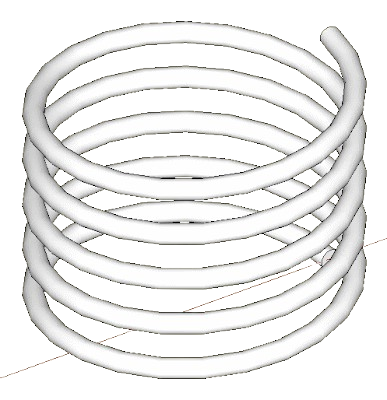

# Helix




This project is a visualization software designed to animate a circular helix. It provides an interactive 3D representation, allowing users to manipulate the `t` (time) and `s` (space) parameters. Additionally, the animation will display:

- T: Tangent vector
- N: Normal vector
- B: Binormal vector
- k: Curvature function

## Development status

Alpha release planned for May 2025.

## Instructions

| Linux |
|:---:|

```bash
$ ./build.sh -help
$ ./build.sh -compile -run
```

| Windows |
|:---:|

No support yet.

## LICENSE

This project is licensed under the [MIT License](https://opensource.org/licenses/MIT). Feel free to use, modify, and distribute the code as needed. See the [LICENSE](LICENSE) file for more information.
